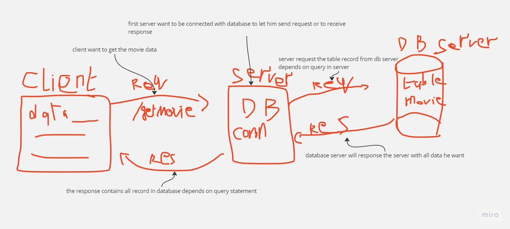

# Movies-Library1

# Project Name - Movies-Library - Project Version

**Author Name**: ahmad khater

## WRRC

;

## Overview

## Getting Started
* ### first step you have to clone this code ssh from this repo

* ### install required files by using `npm init -y`

* ### install express files `npm i express`

* ### to run server just use `npm start`

* ### and then go to  `http://localhost:3000/` you will get the main page of server Note: server down untill you turn it on as i mentioned before

* ### there is 2 routes for now 1 is `/` nad the second one is `/favorite`

## Project Features
## you have some packges to install to deal with this app 

* ### install dotenv package `npm install dotnev` 

* ### install axios package `npm install axios`

* ### install cors package `npm install cors`